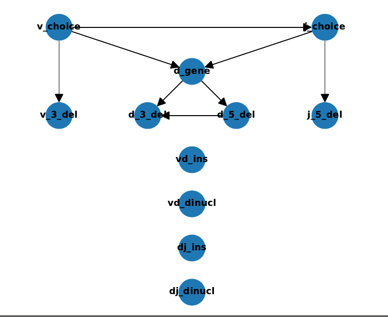
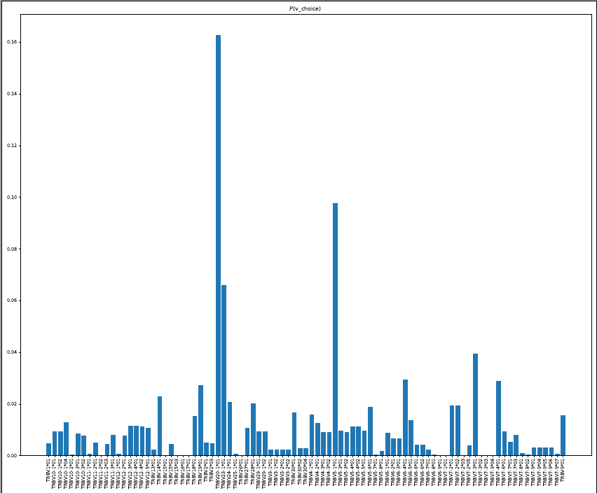
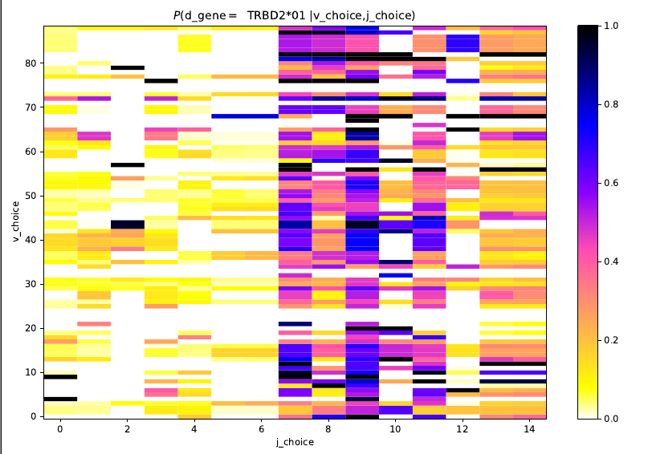

# Pygor3

Pygor3 is a python3 framework to analyze, vizualize, generate 
and infer V(D)J recombination models using the [IGoR](https://github.com/statbiophys/IGoR) software.
With pygor3 new models can be easily created from given V(D)J genomic templates and 
provides a python interface to execute and encapsulate 
IGoR’s input/outputs by using a sqlite3 database that 
contains input sequences, alignments, model parameters, 
conditional probabilities of the model Bayes network, 
best scenarios and generation probabilities in a single db file.
Pygor3 can be use to analyze and get observables from best scenarios and 
also has command line utilities to import/export 
IGoR generated files to [AIRR standard format](https://docs.airr-community.org/en/latest/index.html).

A tutorial to use pygor3 can be found [here](https://pygor3.readthedocs.io/en/latest/Tutorial.html).


## Pygor Installation

Pygor3 uses IGoR's as a background program to infer, evaluate and infer models.
First install IGoR, if is not already installed in your system.

### IGoR Installation
IGoR can be installed using the github repository [IGoR](https://github.com/statbiophys/IGoR)
or by using a docker image.

#### Installation via IGoR's Github
```console
$ git clone https://github.com/statbiophys/IGoR.git
$ cd IGoR
$ ./configure && make && make install
``` 
To test a correct installation use run_demo command.
```console
$ igor -run_demo 
```
Further details can be found [here](https://statbiophys.github.io/IGoR/)

#### Installation via Docker Hub
Another way to get IGoR is by using a [docker](https://www.docker.com/) image, this option 
doesn't require to get a c++ compiler or the source code, and can be installed 
from [this](https://hub.docker.com/r/alfaceor/digor) repository. 

```console
$ docker pull alfaceor/digor
```

And to run it the use of the following script is recommended:  
```console
$ cat digor
#!/bin/bash
docker run --rm -v "$(pwd)":/igor_data -u ${UID}   digor:dev -set_wd /igor_data $@
```

Add executable permissions to the script and optionally add it to system PATH 

```console
$ chmod +x digor
```

To get more information about docker follow [this](https://docs.docker.com/get-started/).

### Pygor installation via pip

(Optional, but Recommended) Install [conda](https://docs.conda.io/en/latest/) or 
[anaconda](https://www.anaconda.com/) and create (or use ) a virtual environment.

```console
$ conda create --name statbiophys python=3.7
$ conda activate statbiophys
```

### Pygor Installation via pip from PyPi repository
Pygor can be installed from [PyPi](https://pypi.org/) repository
using the package manager [pip](https://pip.pypa.io/en/stable/)

```console
(statbiophys) $ pip install pygor3 
```

### Pygor Installation via Github
For the most version of pygor (from Github)    
 ```console
(statbiophys) $ git clone https://github.com/statbiophys/pygor3.git
(statbiophys) $ cd pygor3
(statbiophys) $ pip install -e .
 ```

### (Optional) Pygor configuration
This configuration is just to personalize the paths that pygor3 looks for IGoR.
By default, pygor3 automatically finds the IGoR's path and data directory.
Therefore, if another version of IGoR or the igor docker container 
wants to be used pygor3 configuration file can be edited manually.

This file is located in ${HOME}/.local/share/pygor3/config.json
```console
(statbiophys-dev) $ cat ~/.local/share/pygor3/config.json
```
the variable 'paths.igor_exec' is the executable path and "paths.igor_data" is the directory 
where pygor3 will look for the default IGoR's models.
 
```json
{
    "paths.igor_prefix": null,
    "paths.igor_exec": "/home/<username>/digor",
    "paths.igor_data": "/home/<username>/.local/share/igor",
    "paths.igor_models": null,
    "paths.igor_src": null
}

```

## Command Line Usage

### Quickstart

#### Get demo sample data
Download a copy of demo sequences in current directory

```console
(statbiophys) $ pygor demo-get-data
--------------------------------
Copy data from :  /home/olivares/GitHub/statbiophys/pygor3/pygor3/demo
to:  /home/olivares/testing_pygor/demo
```
This command creates a directory demo with the following structure, with sequences to infer and evaluate
a new model.

```console
demo/
└── data
    └── IgL
        ├── IgL_seqs_memory_Functional.txt
        ├── IgL_seqs_memory_Nofunctional.txt
        ├── IgL_seqs_naive_Functional.txt
        └── IgL_seqs_naive_Nofunctional.txt
```

Change to directory data/IgL

```console
(statbiophys) $ cd data/IgL
```

#### New Models


Now to create a model from scratch, 
download gene templates and anchors from IMGT website [IMGT](http://www.imgt.org/)
A list of available species to download from IMGT can be queried with imgt-get-genomes command and option --info.

```console
(statbiophys) $ pygor imgt-get-genomes --info
--------------------------------
http://www.imgt.org
Downloading data from ... 
List of IMGT available species:

Gallus+gallus
Cercocebus+atys
Mustela+putorius+furo
Macaca+nemestrina
Vicugna+pacos
Mus+cookii
Bos+taurus
Canis+lupus+familiaris
Ornithorhynchus+anatinus
Macaca+mulatta
Rattus+rattus
Mus+minutoides
Danio+rerio
Oncorhynchus+mykiss
Tursiops+truncatus
Felis+catus
Homo+sapiens
Salmo+salar
Macaca+fascicularis
Mus+musculus
Mus+saxicola
Capra+hircus
Sus+scrofa
Mus+pahari
Ovis+aries
Equus+caballus
Camelus+dromedarius
Oryctolagus+cuniculus
Papio+anubis+anubis
Mus+spretus
Rattus+norvegicus
For more details access:
http://www.imgt.org/download/GENE-DB/IMGTGENEDB-GeneList
```

1. Download genomic templates using VJ or VDJ corresponding to the type of chain.
 
    ```console
    (statbiophys) $ pygor imgt-get-genomes --imgt-species Homo+sapiens --imgt-chain IGL -t VJ
    --------------------------------
    http://www.imgt.org
    get_ref_genome
    Homo+sapiens IGLV http://www.imgt.org/genedb/GENElect?query=7.2+IGLV&species=Homo+sapiens
    http://www.imgt.org/genedb/GENElect?query=7.2+IGLV&species=Homo+sapiens
    Homo+sapiens IGLJ http://www.imgt.org/genedb/GENElect?query=7.2+IGLJ&species=Homo+sapiens
    http://www.imgt.org/genedb/GENElect?query=7.2+IGLJ&species=Homo+sapiens
    http://www.imgt.org/genedb/GENElect?query=8.1+IGLV&species=Homo+sapiens&IMGTlabel=2nd-CYS
    No anchor is found for : AC279423|IGLV(I)-11-1*01|Homo sapiens|P|V-REGION|22452..22620|169 nt|1| | | | |169+0=169|partial in 5'| |
    No anchor is found for : D87007|IGLV(I)-20*01|Homo sapiens|P|V-REGION|15573..15858|286 nt|1| | | | |286+0=286| | |
    No anchor is found for : AC279208|IGLV(I)-20*02|Homo sapiens|P|V-REGION|19943..20228|286 nt|1| | | | |286+0=286| | |
    
    ...
    
    Number of features: 0
    Seq('TGCTGTGTTCGGAGGAGGCACCCAGCTGACCGTCCTCG')
    ID: D87017|IGLJ7*02|Homo
    Name: D87017|IGLJ7*02|Homo
    Description: D87017|IGLJ7*02|Homo sapiens|F|J-REGION|18513..18550|38 nt|2| | | | |38+0=38| | |
    Number of features: 0
    Seq('TGCTGTGTTCGGAGGAGGCACCCAGCTGACCGCCCTCG')
    ----------------------
    Genomic VJ templates in files: 
    models/Homo+sapiens/IGL/ref_genome/genomicVs__imgt.fasta models/Homo+sapiens/IGL/ref_genome/genomicJs__imgt.fasta
    
    ```
    
    This command creates a directory **models** with the following structure
        
    ```
    models/
    └── Homo+sapiens
        └── TRB
            ├── models
            └── ref_genome
                ├── genomicDs.fasta
                ├── genomicDs__imgt.fasta
                ├── genomicDs__imgt.fasta_short
                ├── genomicJs.fasta
                ├── genomicJs__imgt.fasta
                ├── genomicJs__imgt.fasta_short
                ├── genomicJs__imgt.fasta_trim
                ├── genomicVs.fasta
                ├── genomicVs__imgt.fasta
                ├── genomicVs__imgt.fasta_short
                ├── genomicVs__imgt.fasta_trim
                ├── J_gene_CDR3_anchors.csv
                ├── J_gene_CDR3_anchors__imgt.csv
                ├── J_gene_CDR3_anchors__imgt.csv_short
                ├── V_gene_CDR3_anchors.csv
                ├── V_gene_CDR3_anchors__imgt.csv
                └── V_gene_CDR3_anchors__imgt.csv_short
    
    ```

    ---
    **Important Note**
    It is important to review carefully your downloaded genes templates. Pygor automatically rename from long
    IMGT descriptions to a short ones. For instance
    
    D86996|IGLV(I)-56*01|Homo sapiens|P|V-REGION|12276..12571|296 nt|1| | | | |296+0=296| | |
    
    D86996|IGLV(I)-56*01|Homo sapiens|P|V-REGION|12576..12876|301 nt|1| | | | |301+0=301| | |
    
    Are renamed as :
    
    IGLV(I)-56*01
     
    IGLV(I)-56*01 
    
    For these cases, is important to rename it or remove it manually, before  create a new model.
    For simplicity in this demo we remove the second IGLV(I)-56*01
    ---

2. Create a new initial default model, with uniform distribution for the conditional probabilities
of Bayes network ("model_marginals.txt" file). Notice that in IGoR this file is called marginals,
but it is not the marginal probability of a recombination event.
    
    ```console
    (statbiophys) $ pygor model-create -M models/Homo+sapiens/IGL/ -t VJ
    --------------------------------
    No D genes were found.
    [Errno 2] No such file or directory: 'models/Homo+sapiens/IGL//ref_genome//genomicDs.fasta'
    No D genes were found.
    [Errno 2] No such file or directory: 'models/Homo+sapiens/IGL//ref_genome//genomicDs.fasta'
    igortask.igor_model_dir_path:  models/Homo+sapiens/IGL/
    Writing model parms in file  models/Homo+sapiens/IGL//models/model_parms.txt
    Writing model marginals in file  models/Homo+sapiens/IGL//models/model_marginals.txt    
    ```
       
    Initial models with uniform parameters model files will be created in files **model_parms.txt** and **model_marginals.txt** at directory path
    ```console
    models/
    └── Homo+sapiens
        └── IGL
            ├── models
            │   ├── model_marginals.txt
            │   └── model_parms.txt
            └── ref_genome
                ├── genomicJs.fasta
                ├── genomicJs__imgt.fasta
                ├── genomicJs__imgt.fasta_short
                ├── genomicJs__imgt.fasta_trim
                ├── genomicVs.fasta
                ├── genomicVs__imgt.fasta
                ├── genomicVs__imgt.fasta_short
                ├── genomicVs__imgt.fasta_trim
                ├── J_gene_CDR3_anchors.csv
                ├── J_gene_CDR3_anchors__imgt.csv
                ├── J_gene_CDR3_anchors__imgt.csv_short
                ├── V_gene_CDR3_anchors.csv
                ├── V_gene_CDR3_anchors__imgt.csv
                └── V_gene_CDR3_anchors__imgt.csv_short
    
    
    ```
   
   At this point you can use a set of non-productive sequence to infer a model within IGoR directly 
   or by using pygor command (the simpler option).
   
    ```console
    (statbiophys) $ pygor igor-infer -M models/Homo+sapiens/IGL/ -i data/IgL/IgL_seqs_naive_Nofunctional.txt -o new_IgL_naive
    --------------------------------
    ===== Running inference =====
    ...
    WARNING: write_model_parms path  [Errno 2] No such file or directory: ''
    Writing model parms in file  new_IgL_naive_parms.txt
    WARNING: IgorModel_Marginals.write_model_marginals path  [Errno 2] No such file or directory: ''
    Writing model marginals in file  new_IgL_naive_marginals.txt
    Database file :  new_IgL_naive

    ```
   
   This will output the following files
   
   ```console
   new_IgL_naive.db
   new_IgL_naive_BN.pdf
   new_IgL_naive_PM.pdf
   new_IgL_naive_marginals.txt
   new_IgL_naive_parms.txt
   ```
   
   where new_hs_trb.db is a database with the encapsulated information about the new model and 
   the date used by IGoR to infer it, new_IgL_naive_BN.pdf is a plot of the Bayesian network(BN) of inferred
   model, new_IgL_naive_PM.pdf are plots of the real marginals of events in BN, and finally the 
   new_IgL_naive_parms.txt and new_IgL_naive_marginals.txt the inferred model in IGoR's format.
   
   
   
#### Model Plots
A model can be plotted from a database file, model directory or by passing the model_parms.txt and 
model_marginals.txt


```console
(statbiophys) $ pygor model-plot -M models/Homo+sapiens/IGL/ -o IgL_plot
```

or

```console
(statbiophys) $ pygor model-plot -D new_IgL_naive.db -o IgL_plot
```
This will output two pdf files with the Marginal Probabilities and Conditional probabilities of events




 

#### Database files
The .db files can contain all the information in IGoR's standard files in a single sqlite database file,
and can be examinated with any sqlite client, like sqlite3 or sqlitebrowser

```console
(statbiophys) $ sqlite3 new_IgL_naive.db 
SQLite version 3.33.0 2020-08-14 13:23:32
Enter ".help" for usage hints.
sqlite> .tables
IgorDAlignments       IgorIndexedSeq        IgorMM_vj_ins       
IgorDGeneTemplate     IgorJAlignments       IgorMP_Edges        
IgorER_j_5_del        IgorJGeneCDR3Anchors  IgorMP_ErrorRate    
IgorER_j_choice       IgorJGeneTemplate     IgorMP_Event_list   
IgorER_v_3_del        IgorMM_j_5_del        IgorVAlignments     
IgorER_v_choice       IgorMM_j_choice       IgorVGeneCDR3Anchors
IgorER_vj_dinucl      IgorMM_v_3_del        IgorVGeneTemplate   
IgorER_vj_ins         IgorMM_v_choice     
IgorIndexedCDR3       IgorMM_vj_dinucl    

```

Pygor has its own methods to maniputate data a database file. 
For instance, db-ls list the contents of the database and the number of records

```console
(statbiophys) $ pygor db-ls -D new_IgL_naive.db 
--------------------------------
=== Sequences tables igor-reads: 
IgorIndexedSeq  :  24985
=== Genomes References tables igor-genomes: 
IgorVGeneTemplate  :  151
IgorJGeneTemplate  :  10
IgorDGeneTemplate  :  0
IgorVGeneCDR3Anchors  :  111
IgorJGeneCDR3Anchors  :  10
=== Alignments tables igor-alignments: 
IgorIndexedCDR3  :  24985
IgorVAlignments  :  846743
IgorJAlignments  :  257400
IgorDAlignments  :  0
=== Model tables igor-model: 
IgorMP_Event_list  :  6
IgorMP_Edges  :  3
IgorMP_ErrorRate  :  1
IgorER_v_choice  :  151
IgorER_j_choice  :  10
IgorER_v_3_del  :  21
IgorER_j_5_del  :  21
IgorER_vj_ins  :  41
IgorER_vj_dinucl  :  4
IgorMM_v_choice  :  151
IgorMM_j_choice  :  1510
IgorMM_v_3_del  :  3171
IgorMM_j_5_del  :  210
IgorMM_vj_ins  :  41
IgorMM_vj_dinucl  :  16
=== Output tables igor-pgen and igor-scenarios: 

```

In a similar way the commands db-rm, db-cp, db-import and db-export can be used to manipulate
database files.

```console
(statbiophys) $ pygor db-cp -D new_IgL_naive.db -o new_IgL_naive_mdl.db --igor-genomes --igor-model
--------------------------------
**** Tables in source database :  new_IgL_naive.db
=== Sequences tables igor-reads: 
IgorIndexedSeq  :  24985
=== Genomes References tables igor-genomes: 
IgorVGeneTemplate  :  151
IgorJGeneTemplate  :  10
IgorDGeneTemplate  :  0
IgorVGeneCDR3Anchors  :  111
IgorJGeneCDR3Anchors  :  10
=== Alignments tables igor-alignments: 
IgorIndexedCDR3  :  24985
IgorVAlignments  :  846743
IgorJAlignments  :  257400
IgorDAlignments  :  0
=== Model tables igor-model: 
IgorMP_Event_list  :  6
IgorMP_Edges  :  3
IgorMP_ErrorRate  :  1
IgorER_v_choice  :  151
IgorER_j_choice  :  10
IgorER_v_3_del  :  21
IgorER_j_5_del  :  21
IgorER_vj_ins  :  41
IgorER_vj_dinucl  :  4
IgorMM_v_choice  :  151
IgorMM_j_choice  :  1510
IgorMM_v_3_del  :  3171
IgorMM_j_5_del  :  210
IgorMM_vj_ins  :  41
IgorMM_vj_dinucl  :  16
=== Output tables igor-pgen and igor-scenarios: 
**** Tables in destiny database:  new_IgL_naive_mdl.db
=== Sequences tables igor-reads: 
=== Genomes References tables igor-genomes: 
IgorVGeneTemplate  :  151
IgorJGeneTemplate  :  10
IgorDGeneTemplate  :  0
IgorVGeneCDR3Anchors  :  111
IgorJGeneCDR3Anchors  :  10
=== Alignments tables igor-alignments: 
=== Model tables igor-model: 
IgorMP_Event_list  :  6
IgorMP_Edges  :  3
IgorMP_ErrorRate  :  1
IgorER_v_choice  :  151
IgorER_j_choice  :  10
IgorER_v_3_del  :  21
IgorER_j_5_del  :  21
IgorER_vj_ins  :  41
IgorER_vj_dinucl  :  4
IgorMM_v_choice  :  151
IgorMM_j_choice  :  1510
IgorMM_v_3_del  :  3171
IgorMM_j_5_del  :  210
IgorMM_vj_ins  :  41
IgorMM_vj_dinucl  :  16
=== Output tables igor-pgen and igor-scenarios: 

```
 


#### Model evaluation
Once we have an inferred model we can evaluate the probability of a particular sequence to be 
generated (pgen) and get the most probable scenarios for the recombination of input sequences 
or generate synthetic sequences. We can evaluate sequences using the following files: model_parms.txt, model_marginals.txt, genomicXs.fasta, and X_gene_CDR3_anchors.csv or we can just use a database file with all this information like above. For instance the "new_IgL_naive_mdl.db" file, in the example above, contains 
only the model and genomes information, which is necessary for the alignment and evaluation for IGoR.

```console
(statbiophys) $ pygor igor-evaluate -D new_IgL_naive_mdl.db -i data/IgL/IgL_seqs_naive_Functional_small.txt  -o IgL_naive_evaluated
```


An tsv airr standard format is created with the rearragement. 

```
sequence_id	sequence	rev_comp	productive	v_call	d_call	j_call	sequence_alignment	germline_alignment	junction	junction_aa	v_cigar	d_cigar	j_cigar	v_score	v_identity	v_support	v_sequence_start	v_sequence_end	v_germline_start	v_germline_end	v_alignment_start	v_alignment_end	d_score	d_identity	d_support	d_sequence_start	d_sequence_end	d_germline_start	d_germline_end	d_alignment_start	d_alignment_end	j_score	j_identity	j_support	j_sequence_start	j_sequence_end	j_germline_start	j_germline_end	j_alignment_start	j_alignment_end	sequence_aa	vj_in_frame	stop_codon	complete_vdj	locus	sequence_alignment_aa	n1_length	np1	np1_aa	np1_length	n2_length	np2	np2_aa	np2_length	p3v_length	p5d_length	p3d_length	p5j_length	scenario_rank	scenario_proba_cond_seq	pgen	quality	quality_alignment
0	CAGTCTCCCAGGTACAAAGTCACAAAGAGGGGACAGGATGTAACTCTCAGGTGTGATCCAATTTCGAGTCATGCAACCCTTTATTGGTATCAACAGGCCCTGGGGCAGGGCCCAGAGTTTCTGACTTACTTCAATTATGAAGCTCAACCAGACAAATCAGGGCTGCCCAGTGATCGGTTCTCTGCAGAGAGGCCTGAGGGATCCATCTCCACTCTGACGATTCAGCGCACAGAGCAGCGGGACTCAGCCATGTATCGCTGTGCTAGCAGCATTCCTCGGGCTGTCAGATACGCAGTATTTTGGCCCAGGCACCCGGCTGACAGTGCTCG	F		TRBV7-7*01	TRBD2*02	TRBJ2-3*01	GGTGCTGGAGTCTCCCAGTCTCCCAGGTACAAAGTCACAAAGAGGGGACAGGATGTAACTCTCAGGTGTGATCCAATTTCGAGTCATGCAACCCTTTATTGGTATCAACAGGCCCTGGGGCAGGGCCCAGAGTTTCTGACTTACTTCAATTATGAAGCTCAACCAGACAAATCAGGGCTGCCCAGTGATCGGTTCTCTGCAGAGAGGCCTGAGGGATCCATCTCCACTCTGACGATTCAGCGCACAGAGCAGCGGGACTCAGCCATGTATCGCTGTGCCAGCAGCATTCCTCGGGCTGTCAGATACGCAGTATTTTGGCCCAGGCACCCGGCTGACAGTGCTCG		TGTGCTAGCAGCATTCCTCGGGCTGTCAGATACGCAGTATTTT		285M	4M	45M	1425			2	285	16	283			20			290	292	10	13			225			7	50	6	50		6ATTCCT		6	4	CTGT		4	0	0	0	0	1	0.02729091.34834e-19		
0	CAGTCTCCCAGGTACAAAGTCACAAAGAGGGGACAGGATGTAACTCTCAGGTGTGATCCAATTTCGAGTCATGCAACCCTTTATTGGTATCAACAGGCCCTGGGGCAGGGCCCAGAGTTTCTGACTTACTTCAATTATGAAGCTCAACCAGACAAATCAGGGCTGCCCAGTGATCGGTTCTCTGCAGAGAGGCCTGAGGGATCCATCTCCACTCTGACGATTCAGCGCACAGAGCAGCGGGACTCAGCCATGTATCGCTGTGCTAGCAGCATTCCTCGGGCTGTCAGATACGCAGTATTTTGGCCCAGGCACCCGGCTGACAGTGCTCG	F		TRBV7-7*01	TRBD2*01	TRBJ2-3*01	GGTGCTGGAGTCTCCCAGTCTCCCAGGTACAAAGTCACAAAGAGGGGACAGGATGTAACTCTCAGGTGTGATCCAATTTCGAGTCATGCAACCCTTTATTGGTATCAACAGGCCCTGGGGCAGGGCCCAGAGTTTCTGACTTACTTCAATTATGAAGCTCAACCAGACAAATCAGGGCTGCCCAGTGATCGGTTCTCTGCAGAGAGGCCTGAGGGATCCATCTCCACTCTGACGATTCAGCGCACAGAGCAGCGGGACTCAGCCATGTATCGCTGTGCCAGCAGCATTCCTCGGGCTGTCAGATACGCAGTATTTTGGCCCAGGCACCCGGCTGACAGTGCTCG		TGTGCTAGCAGCATTCCTCGGGCTGTCAGATACGCAGTATTTT		285M	4M	45M	1425			2	285	16	283			20			290	292	10	13			225			7	50	6	50		6ATTCCT		6	4	CTGT		4	0	0	0	0	2	0.02729091.34834e-19		
...
```


## Documentation

All the command line interface commands can be used in a python environment, like jupyter notebook, by 
exporting the pygor3 package

```python
import pygor3 as p3
mdl = p3.IgorModel(model_parms_file="model_parms.txt", model_marginals_file="model_marginals.txt")
```

For further details checkout the [documentation](https://pygor3.readthedocs.io/en/latest/) and notebooks directory.


## Contact

For any question or issue please open an [issue](https://github.com/statbiophys/pygor3/issues) or email [us](mailto:carlos.olivares@phys.ens.fr).


## LICENSE
Free use of pygor3 is granted under the terms of the [GNU General Public License version 3](https://www.gnu.org/licenses/quick-guide-gplv3.html) (GPLv3).


