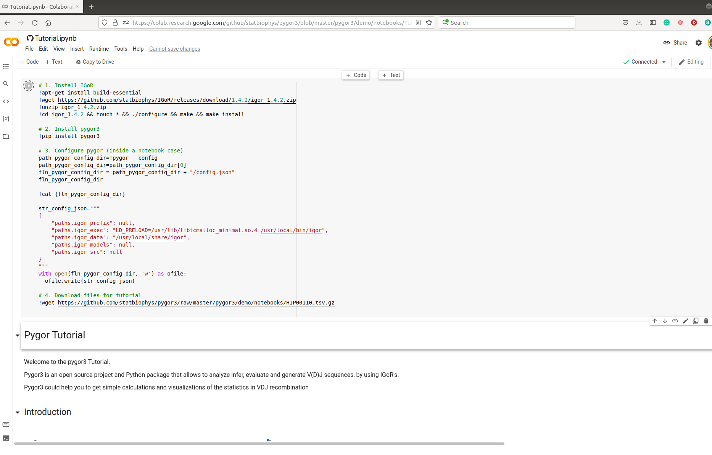

# Preparation for 2022-01-25 tutorial

## Install IGOR
### Gnu-Linux
```console
$ sudo apt-get install build-essential
$ wget https://github.com/statbiophys/IGoR/releases/download/1.4.2/igor_1.4.2.zip
$ unzip igor_1.4.2.zip
$ cd igor_1.4.2
$ ./configure && make && sudo make install
```

If you use another distribution than Ubuntu replace first command by
what's needed to install gcc.

If don't have root access replace last command by
```console
$ ./configure --prefix=${HOME}/.local/ && make && make install
``` 

### MacOS
```console
$ /bin/bash -c "$(curl -fsSL https://raw.githubusercontent.com/Homebrew/install/HEAD/install.sh)"
$ brew install gcc@6 
$ curl -LO https://github.com/statbiophys/IGoR/releases/download/1.4.2/igor_1.4.2.zip -o igor_1.4.2.zip
$ unzip igor_1.4.2.zip
$ cd igor_1.4.2/
$ ./configure CC=gcc-6 CXX=g++-6 && make && sudo make install
``` 
If gcc-6 is not offered by your version of homebrew, try a different version (preferably the lowest version above gcc-6).

If don't have root access replace last command by
```console
$ ./configure CC=gcc-6 CXX=g++-6 --prefix=${HOME}/.local/ && make && make install
``` 

If you already have homebrew skip the first command. If you prefer to
use macports see [here](https://statbiophys.github.io/IGoR/#macos).

## Install pygor
First install [Anaconda](https://docs.anaconda.com/anaconda/install/).

Then run
```console
$ conda create --name statbiophys python=3.7
$ conda activate statbiophys
(statbiophys) $ conda install jupyterlab
(statbiophys) $ pip install pygor3 
(statbiophys) $ pygor demo-get-data
(statbiophys) $ cd demo
(statbiophys) $ jupyter-lab
```

After installation, from jupyter-lab please open the directory 
notebooks and execute Tutorial.ipynb notebook.

If pygor3 did not recognize your IGoR installation please edit
pygor3 configuration file (config.json) located in the directory given the command:
```console
$ (statbiophys) $ pygor --config
``` 
and edit the location of IGoR's executable
and the root of the models directory.

If you have a local installation, this is most likely something like $HOME/.local/bin/igor and $HOME/.local/share/igor.
So edit the file as follows:

```console
{
    "paths.igor_prefix": null,
    "paths.igor_exec": "/your/home/path/.local/bin/igor",
    "paths.igor_data": "/your/home/path/.local/share/igor",
    "paths.igor_models": null,
    "paths.igor_src": null
}
```

where /your/home/path is given by
```console
echo $HOME
```

If the installation is global, look for them in e.g. /usr/local/bin and /usr/local/share.

## Pygor Colab

This tutorial can be run remotely (without local installation in your computer) by
using colab.

First, open this link https://colab.research.google.com/github/statbiophys/pygor3/blob/master/pygor3/demo/notebooks/Tutorial.ipynb
in your browser and copy the following commands 

```console
# 1. Install IGoR
!apt-get install build-essential
!wget https://github.com/statbiophys/IGoR/releases/download/1.4.2/igor_1.4.2.zip
!unzip igor_1.4.2.zip
!cd igor_1.4.2 && touch * && ./configure && make && make install

# 2. Install pygor3
!pip install pygor3

# 3. Configure pygor (inside a notebook case)
path_pygor_config_dir=!pygor --config
path_pygor_config_dir=path_pygor_config_dir[0]
fln_pygor_config_dir = path_pygor_config_dir + "/config.json"
fln_pygor_config_dir

!cat {fln_pygor_config_dir}

str_config_json="""
{
    "paths.igor_prefix": null,
    "paths.igor_exec": "LD_PRELOAD=/usr/lib/libtcmalloc_minimal.so.4 /usr/local/bin/igor",
    "paths.igor_data": "/usr/local/share/igor",
    "paths.igor_models": null,
    "paths.igor_src": null
}
"""
with open(fln_pygor_config_dir, 'w') as ofile:
  ofile.write(str_config_json)

# 4. Download files for tutorial
!wget https://github.com/statbiophys/pygor3/raw/master/pygor3/demo/notebooks/HIP00110.tsv.gz

```

in the first cell and execute it to install IGoR/pygor in the remote machine.



